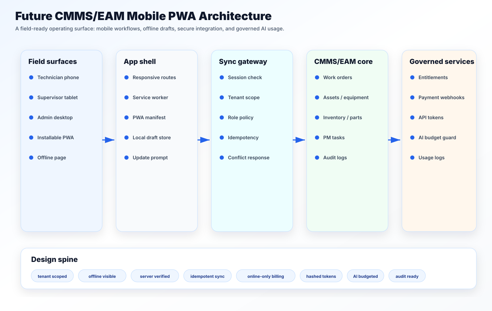

# Building the Mobile Edge of a Future CMMS/EAM Platform

## Executive summary

A modern CMMS/EAM system is not complete if it only works from a desktop browser. The people who create the most important operational data are usually standing near equipment: a compressor, pump, rooftop unit, production line, rail asset, vehicle, or electrical panel. They need the app to work quickly, clearly, and sometimes with poor connectivity.

This case study describes a field-ready CMMS/EAM PWA architecture. The goal is not to turn the browser into a full offline database. The goal is more practical: make the common field actions resilient, keep the risky actions online, and give administrators enough control over billing, integrations, API tokens, and AI usage.

The main idea is simple:

> The mobile app can store drafts. The server still owns trust.

That one rule keeps the design grounded. Technicians can keep working when the network drops. The server still validates tenant access, role permissions, entity versions, inventory state, entitlement rules, and audit requirements when sync resumes.

## The problem

Traditional CMMS screens are often built around desktop tables, dense forms, and admin-heavy navigation. That works for back-office users, but it breaks down in the field.

A technician might need to:

- open assigned work orders with one hand;
- scan an asset tag;
- add a note and photo;
- record labor time;
- enter a meter reading;
- request a part;
- close or update work status;
- continue after losing signal.

At the same time, the platform must protect the business:

- users should not access another tenant's data;
- offline updates should not overwrite newer server records;
- billing state should not be controlled by a client callback;
- API tokens should not behave like permanent admin passwords;
- AI usage should be budgeted, routed, and logged safely.

That is why this showcase combines mobile, PWA, offline sync, payment entitlements, API token governance, and AI usage control into one package. They are all part of the same field platform boundary.

## Product positioning

This project is best described as a **mobile operating layer for future CMMS/EAM**.

It is not a report module, not a generic admin console, and not a standalone payment system. It is the layer that lets a field user do maintenance work from a phone while the platform keeps enterprise-grade controls intact.

The architecture has four surfaces:

1. **Field app** — work orders, assets, inventory lookup, notes, photos, labor, meter readings, and offline queue.
2. **PWA runtime** — manifest, app shell caching, offline page, update prompt, and local draft storage.
3. **Sync and policy gateway** — tenant scope, role policy, idempotency, validation, conflict handling, and audit.
4. **Governance console** — entitlements, payments, API tokens, AI budgets, and usage logs.

This structure gives the project a clear story. It is not a collection of unrelated features. It is a platform pattern for mobile CMMS/EAM operations.

## Architecture

The architecture separates convenience from authority.

The phone can cache the app shell. It can hold a local draft. It can show queue state. It can retry when the network returns. But it cannot bypass the server.

The server checks:

- current session;
- tenant boundary;
- role and module access;
- operation scope;
- entity version;
- idempotency key;
- entitlement state;
- audit rules.

This is the difference between "offline friendly" and "unsafe offline writes." The system is friendly to field users but strict about final state.

## Mobile field UX

The mobile interface should start with repeated field tasks, not the desktop menu. A practical technician home screen should answer three questions quickly:

1. What do I need to work on now?
2. Which asset am I standing in front of?
3. What can I capture before I leave this location?

Good mobile CMMS screens use cards and sections instead of shrinking a large table. They keep the primary action close to the thumb zone. They show sync state next to the action that created it. They treat the camera, scanner, search, and offline queue as first-class tools.

## Offline sync

Offline support should be explicit. The user should not wonder whether their work disappeared.

Safe offline actions include:

- work-order notes;
- labor entries;
- meter readings;
- inspection checklist answers;
- photo attachments waiting for upload;
- parts request drafts.

Poor offline candidates include:

- payment changes;
- API token creation;
- AI provider calls;
- final approvals requiring current server state;
- inventory adjustments requiring strict real-time stock validation.

The queue item needs enough context for a safe retry: tenant, actor, entity, version, action, payload version, retry count, idempotency key, and status.

## Payments and entitlements

Billing belongs on the server. A browser can start a checkout session, but it should not decide that an invoice is paid or a module is entitled.

The internal payment model should track billing accounts, subscriptions, invoices, payment events, credits, entitlements, and audit logs. The external provider handles card collection and settlement. The application handles verified state changes through signed webhooks and idempotency checks.

The reason this belongs in a mobile PWA showcase is entitlement. Mobile offline drafts, API access, exports, and AI usage are often plan-controlled. Billing changes should flow into those entitlements in a clear, auditable way.

## API token governance

API tokens are useful for integrations, imports, exports, automation jobs, and partner systems. They are also dangerous if they become long-lived administrator credentials.

A safer token system follows a few rules:

- show the raw token only once;
- store only a hash and short prefix;
- bind tokens to a tenant;
- require explicit scopes;
- support expiry, rotation, and revocation;
- rate limit by token and tenant;
- log safe metadata, not the full token.

This is practical engineering, not theoretical security. When a token leaks, the team needs a quick way to see what it could access, when it was last used, and how to revoke it.

## AI usage governance

AI features can help a mobile CMMS/EAM system in narrow, useful ways:

- summarize a long work-order history;
- draft a cleaner maintenance note;
- explain an alarm in plain language;
- turn a technician note into a structured checklist;
- suggest what evidence is missing before closeout.

The browser should not call a model provider directly. The app should route AI through a server-side gateway that checks feature access, tenant policy, model allowlist, budget, redaction, and logging rules.

The safest first version is read-assistive. It helps users understand, summarize, and prepare work. It does not silently create, approve, or close operational records.

## Security and privacy

This public showcase is deliberately sanitized. The diagrams and mock screens use placeholder data only.

The implementation rules are straightforward:

- server-side secrets stay server-side;
- tenant checks happen before reads and writes;
- payment webhooks are verified before billing state changes;
- tokens are hashed;
- AI requests are budgeted and logged with metadata;
- offline storage is minimized;
- private field notes are not dumped into general logs;
- admin and billing actions are online-only.

## Implementation roadmap

The recommended build sequence is:

1. Stabilize mobile work-order and asset flows.
2. Add installable PWA shell, offline page, and update prompt.
3. Add local draft queue for notes, labor, photos, meter readings, and inspections.
4. Add sync endpoint with idempotency and conflict handling.
5. Add queue visibility and conflict review screens.
6. Add entitlements for mobile, offline, API, and AI features.
7. Add payment provider checkout and verified webhook processing.
8. Add API token lifecycle: create, hash, scope, expire, rotate, revoke, audit.
9. Add AI gateway with allowlists, budgets, redaction, and usage logs.
10. Add operational dashboards for queue failures, webhook retries, token use, and AI spend.

## What this demonstrates

This project demonstrates product judgment as much as code. It shows how to turn a scattered set of concerns into one coherent platform story:

- mobile UX for real field use;
- offline drafts without unsafe trust assumptions;
- server-side governance for enterprise features;
- integration access that is scoped and auditable;
- AI assistance that is useful but bounded.

That is the shape of a future CMMS/EAM system: field-ready, tenant-aware, offline-tolerant, and governed by design.
