# CMMS Mobile PWA Architecture, Internal Payments, and Token Governance

This repository is a public-safe implementation guide for a mobile-first CMMS application.
It focuses on four areas that often decide whether an enterprise maintenance system works well
outside a desktop browser:

- Mobile optimization for technicians, supervisors, administrators, and field teams
- Progressive Web App behavior for installability, offline drafts, caching, and sync
- Internal payment and entitlement design without storing raw card data
- API token and AI token governance for controlled integrations and model usage

The repository is documentation-only. It does not include private URLs, credentials, customer
names, production tenant IDs, payment provider secrets, API keys, model provider keys, or real
operational records.

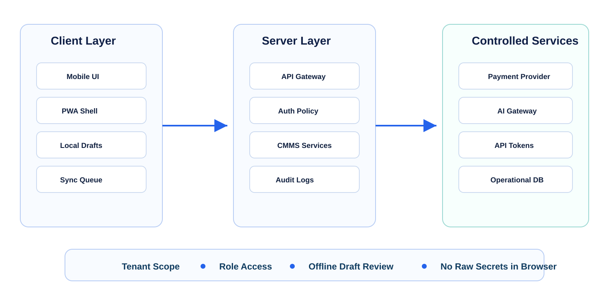

## Project Snapshot

Project type: technical architecture guide and portfolio case study.

Domain: CMMS, field maintenance, mobile SaaS, PWA architecture, internal billing, API access,
AI usage controls, and tenant-aware security.

Primary users: technicians, maintenance planners, supervisors, administrators, finance users,
operations leads, and integration developers.

Core idea: a CMMS can stay usable on phones and tablets while keeping offline edits safe,
payments server-controlled, API tokens scoped, and AI usage governed by tenant budgets and
audit rules.

Core capabilities covered here:

- Mobile-first work-order and asset workflows
- Responsive layouts that adapt dense CMMS screens to small devices
- PWA manifest, app shell caching, offline fallback, update behavior, and install prompts
- Offline draft queues for notes, labor, meter readings, photos, parts requests, and status changes
- Conflict handling for records edited while the device is offline
- Internal payment records, invoice status, entitlements, credits, and provider webhook processing
- API tokens with tenant scope, hashed storage, prefix display, expiry, rotation, scopes, and audit
- AI token budgeting, tenant usage limits, provider routing, sanitized logging, and model allowlists
- Observability that tracks operational metadata without exposing private payloads

## Background and Use Cases

CMMS users often work in places where a desktop application is not practical. A technician may
scan an asset tag in a mechanical room, add a photo before closing a work order, update a meter
reading near equipment, or record labor time after a repair. A supervisor may review backlog from
a tablet during a shift handoff. An administrator may manage subscriptions, API access, and AI
budgets from a desktop.

A normal responsive page can resize, but it does not automatically solve field use. The system
needs fast navigation, large touch targets, offline-safe drafts, clear sync status, secure token
handling, and payment flows that stay outside the browser whenever sensitive payment data is
involved.

The design in this repository treats mobile, PWA, payments, API access, and AI usage as one
connected product surface. Each part has its own responsibility, but all of them depend on the
same tenant, role, audit, and privacy boundaries.

## Architecture Overview

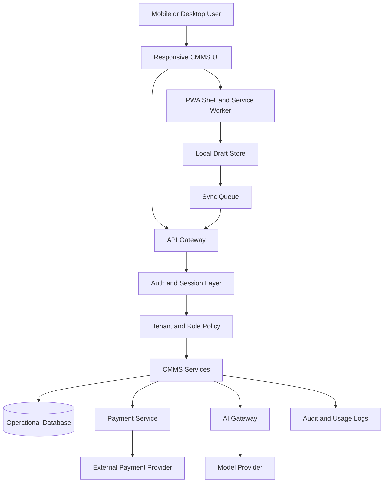

The app shell and service worker handle installability, caching, offline fallback, and update
behavior. The local draft store keeps temporary user edits on the device until the API can accept
them. The API gateway applies authentication, tenant policy, token scope checks, rate limits, and
audit logging before any CMMS service reads or changes data.

Payment and AI provider credentials remain server-side. The browser receives only short-lived
session results, public configuration, and user-visible status.

## Expanded Visual Tour

The expanded package adds a second set of public-safe diagrams focused on the field app and
governance console.

### Field Workflow

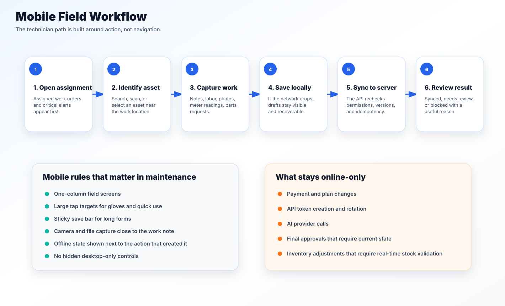

The field workflow starts with assigned work, asset lookup, capture actions, and a visible offline
queue. It treats scan, search, notes, photos, labor, and meter readings as first-class mobile tasks.

### PWA Cache Strategy

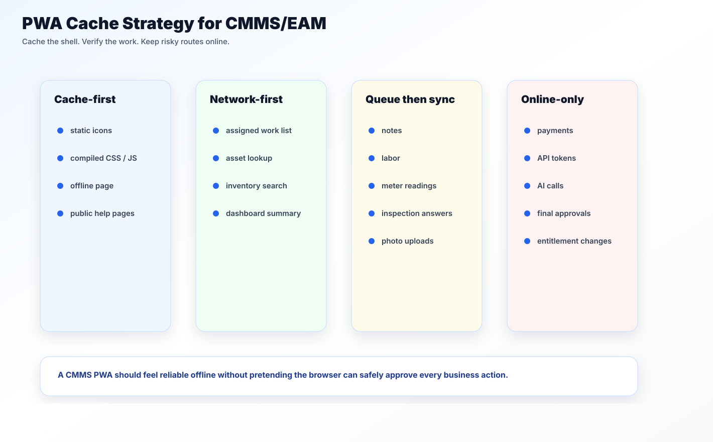

The cache strategy separates installable shell files from operational data. Static app resources
can be cache-first, work-order reads can be network-first, draft writes can be queued, and billing,
token, and AI routes stay online-only.

### Offline State Machine

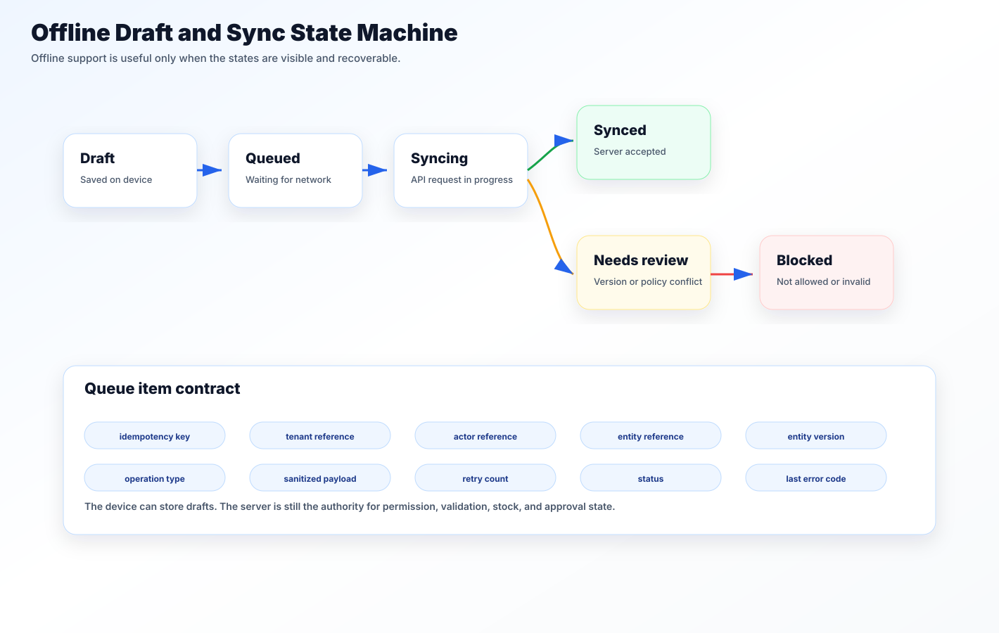

The offline state machine makes queue behavior visible: queued, syncing, synced, blocked, failed,
or waiting for review. Users should not have to guess whether a field edit is safe.

### Payments, Tokens, and AI Usage

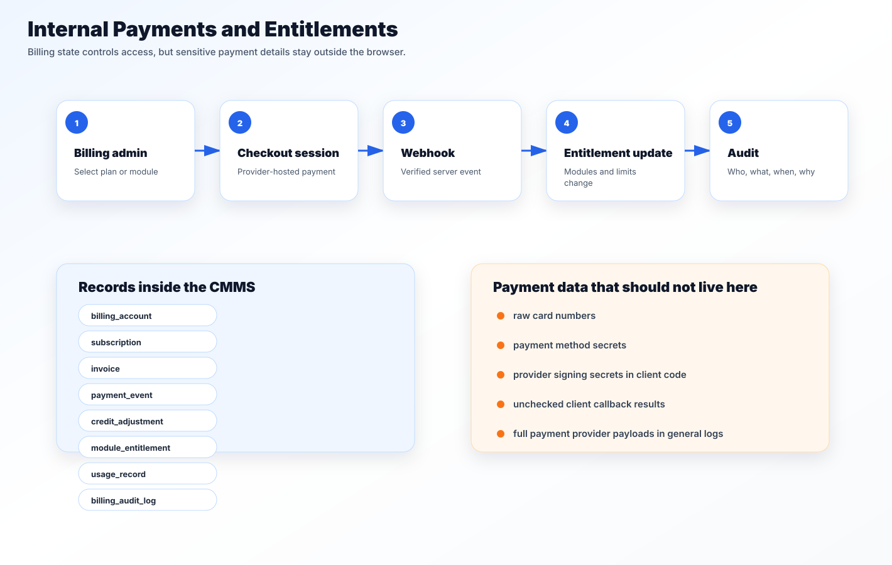

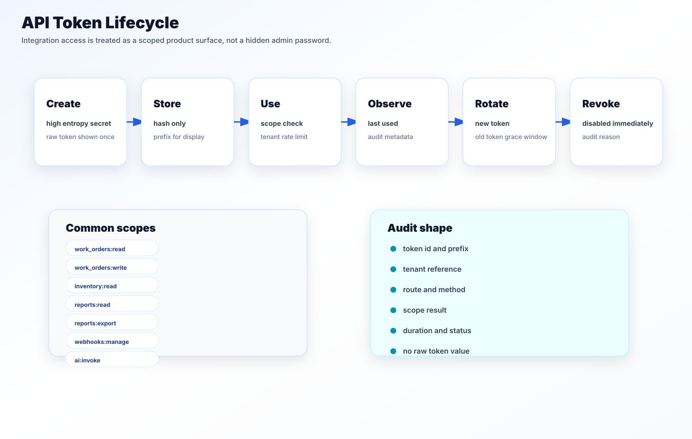


These diagrams show how billing events become entitlements, how API tokens move through creation,
hashing, verification, rotation, and revocation, and how AI requests pass through budget and
logging controls before reaching a provider route.

## Sanitized Mock Screens

The screenshot files are generated mock screens for this public repository. They do not contain
real tenant data, customer names, production URLs, private emails, payment details, API keys, or
model provider credentials.

| Mobile work order | Offline queue | Governance console |
| --- | --- | --- |
| 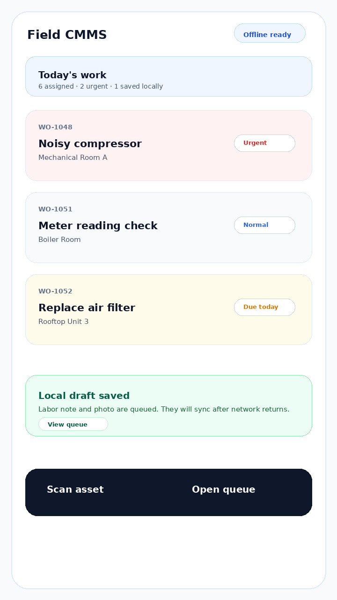 | 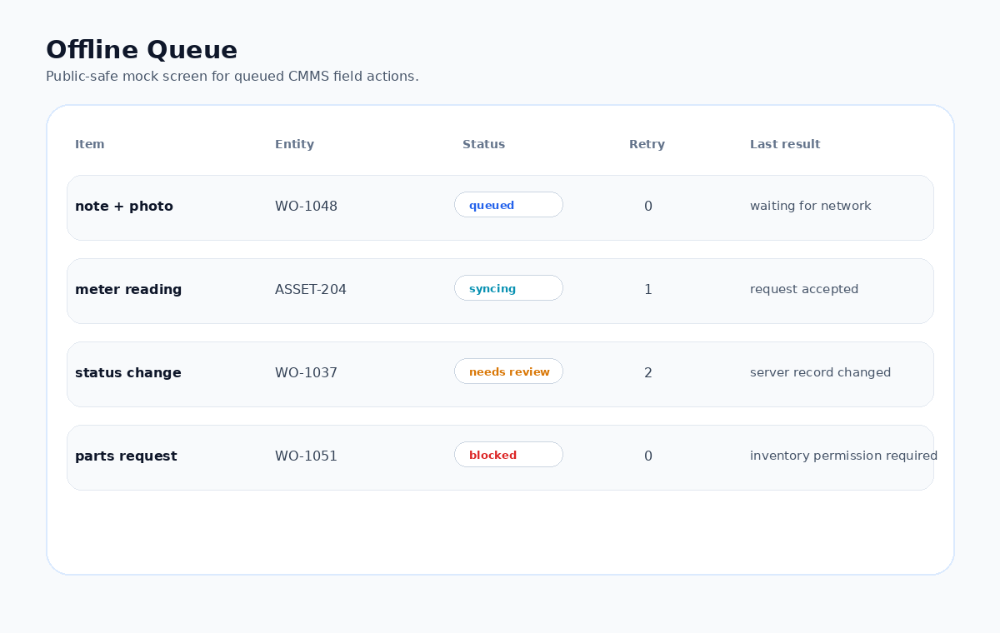 | 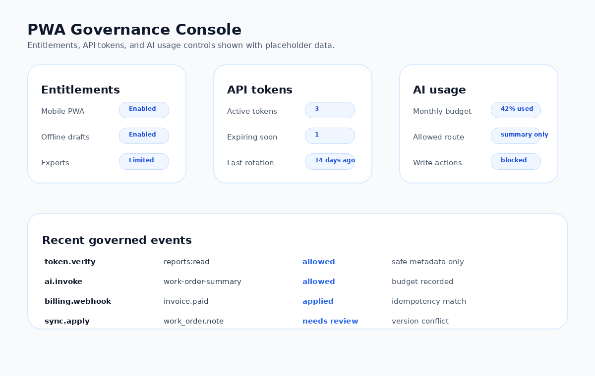 |

## Mobile Optimization

Mobile optimization starts with the workflows that field users repeat every day:

- Open assigned work orders
- Search equipment and inventory
- Scan or type an asset identifier
- Add notes, labor, parts, meter readings, and attachments
- Change status or close a work order
- Review alerts and supervisor approvals
- Continue work after losing network access

The mobile UI should avoid shrinking a desktop table into a tiny screen. Dense grids become
stacked rows or task cards. Secondary fields move into expandable details. Long forms become
short sections with local autosave. Primary actions stay close to the thumb zone, while destructive
actions require confirmation.

Recommended mobile rules:

- Keep route navigation predictable and shallow for field tasks.
- Use bottom navigation or a compact task bar for common technician actions.
- Keep tap targets large enough for gloves and fast field use.
- Use native input types for numbers, dates, search, email, phone, and file capture.
- Convert report-heavy pages into summary cards on mobile and keep detailed exports on desktop.
- Show sync state near the action that created it: `saved locally`, `syncing`, `synced`, or
  `needs review`.
- Keep failed submissions visible so users can retry without retyping.
- Compress photos before upload when quality requirements allow it.
- Avoid loading charts, admin panels, payment screens, and report builders on technician routes
  until the user opens them.

More detail is in [docs/mobile-optimization.md](docs/mobile-optimization.md).

## PWA Implementation

The PWA layer makes the CMMS installable where supported and more resilient during repeat use.
It does not replace the server, permissions, or data model. It provides an app-like entry point,
caches the safe parts of the interface, and gives the user a controlled offline experience.

PWA pieces:

- `manifest.webmanifest` for name, icons, display mode, colors, start URL, and shortcuts
- Service worker for app shell caching, offline fallback, version cleanup, and update flow
- Install icons sized for supported platforms
- Offline page that explains what can and cannot be done without network access
- Cache strategy that separates static assets, app shell routes, API responses, and media
- Update prompt so users do not stay on stale application code silently

The service worker should cache static shell files and public assets. Authenticated API responses
need tighter rules. Payment, billing, token management, and AI provider routes should normally be
online-only because they depend on current permissions, account state, quota, and audit accuracy.

More detail is in [docs/pwa-implementation.md](docs/pwa-implementation.md).

## Offline and Sync Model

Offline support should be explicit. The app should not imply that every action can be completed
without a network connection. Safe offline workflows are usually drafts or queued requests:

- Work-order notes
- Labor entries
- Meter readings
- Inspection checklist answers
- Parts request drafts
- Photo attachments waiting for upload
- Status change requests that require server confirmation

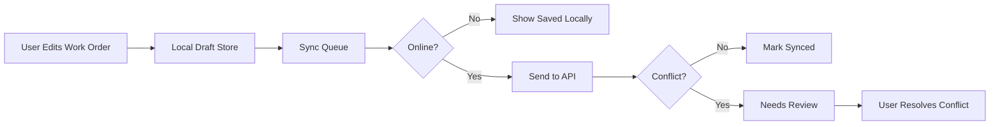

Each queued mutation should include tenant context, user context, target entity, operation type,
client timestamp, idempotency key, retry count, and payload version. The server still performs
permission checks when the device reconnects. Offline storage is a convenience layer, not a trust
boundary.

More detail is in [docs/offline-sync.md](docs/offline-sync.md).

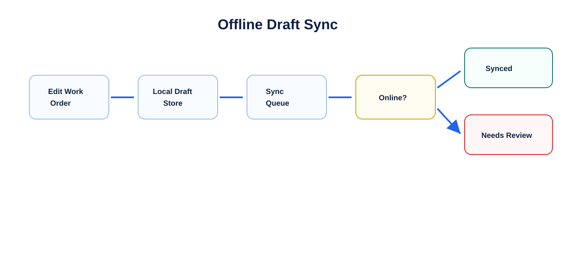

## Internal Payment System

The internal payment system tracks billing state inside the CMMS without storing raw card data.
The application manages accounts, plans, invoices, credits, entitlements, usage records, and
audit logs. A payment provider handles card collection, payment methods, authorization, and
settlement.

Typical internal records:

- Billing account
- Subscription
- Plan and module entitlement
- Invoice
- Payment event
- Credit adjustment
- Usage record
- Billing audit log

Payment flow:

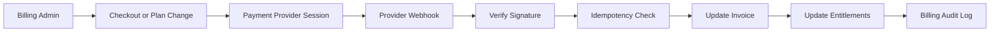

The system should use idempotency keys for checkout creation and provider event IDs for webhook
processing. Duplicate webhook delivery is normal, so the billing state must not change twice for
the same provider event. Entitlements should update from verified billing events, not from
untrusted client callbacks.

More detail is in [docs/payment-system.md](docs/payment-system.md).

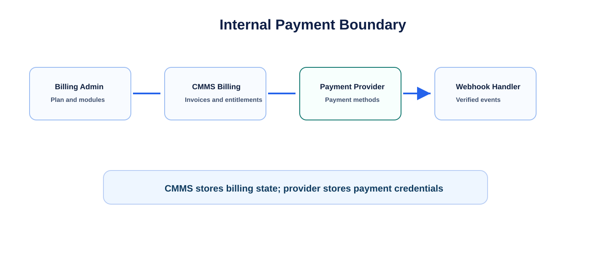

## API Token System

API tokens support integrations, import/export jobs, automation clients, and controlled
machine-to-machine access. They should not behave like permanent administrator passwords.

Token rules:

- Token values are generated with high entropy.
- Raw token values are shown only once.
- Only a hash and short display prefix are stored.
- Tokens belong to a tenant.
- Tokens carry explicit scopes.
- Tokens can expire, rotate, and revoke.
- Last-used metadata is recorded.
- Requests are rate-limited by token and tenant.
- Audit logs store token ID, prefix, scope, route, status, and timestamp, not the full token.

Common scopes:

- `work_orders:read`
- `work_orders:write`
- `inventory:read`
- `reports:read`
- `reports:export`
- `webhooks:manage`
- `ai:invoke`

More detail is in [docs/api-token-system.md](docs/api-token-system.md).

## AI Token Governance

AI token governance is separate from normal API token handling. An API token answers the question
“who can call the system?” An AI token budget answers “how much model usage is allowed, for which
tenant, user, feature, and provider route?”

The browser should never receive a model provider secret. AI calls go through a server-side gateway
that checks authentication, tenant policy, feature enablement, model allowlist, budget remaining,
safety rules, and logging policy before calling a provider.

AI usage logs should track metadata:

- Tenant reference
- Actor reference
- Feature name
- Provider route or model class
- Prompt category
- Token estimate before the call
- Actual token usage when available
- Cost estimate
- Cache result
- Safety result
- Request status

Logs should not store raw private work orders, manuals, payments, tenant data, or full prompts
unless a clear retention policy and user-facing controls allow it.

More detail is in [docs/ai-token-governance.md](docs/ai-token-governance.md).

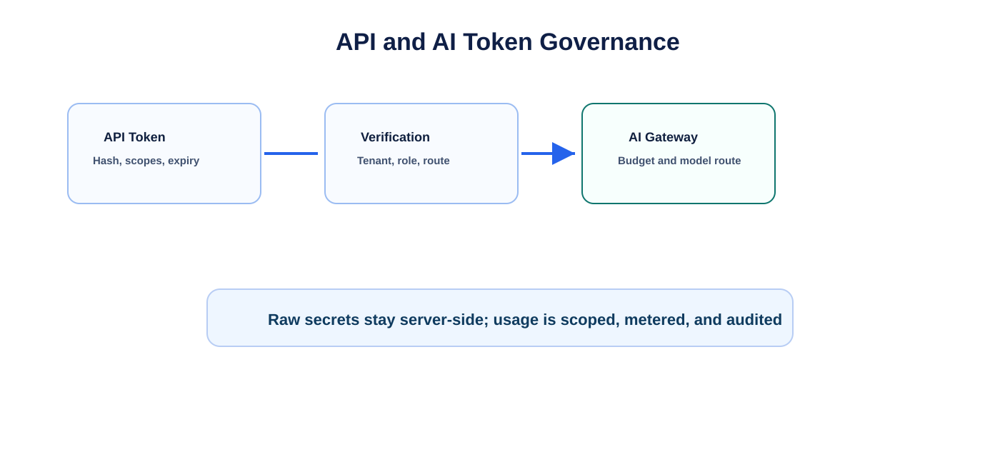

## Security and Privacy

Security is applied at every layer, not only at login. Tenant and role checks happen before data
access. Token scope checks happen before integration actions. Billing permissions happen before
plan or entitlement changes. AI policy checks happen before provider calls.

Public-safe rules used for this repository:

- No private tenant names
- No customer names
- No production URLs
- No real emails
- No credentials
- No database connection strings
- No provider secrets
- No real payment payloads
- No raw API tokens
- No raw AI prompts with private operational content

Implementation rules:

- Keep payment provider secrets and AI provider secrets on the server.
- Store hashes of API tokens, not token values.
- Verify payment webhook signatures before changing billing state.
- Apply idempotency to payment, sync, and external integration operations.
- Redact sensitive payloads before logs are written.
- Keep billing, token, and AI audit logs separate from general application logs.
- Use least-privilege scopes for integrations and service accounts.

More detail is in [docs/security-privacy.md](docs/security-privacy.md).

## Implementation Roadmap

Suggested sequence:

1. Stabilize mobile navigation, responsive work-order screens, and technician task flows.
2. Add manifest, icons, app shell caching, offline fallback, and update prompt.
3. Add local draft storage and sync queue for safe work-order operations.
4. Add conflict detection and review screens for offline edits.
5. Add internal billing records and read-only entitlement checks.
6. Add provider checkout and verified webhook processing.
7. Add API token issuance, hashing, scopes, expiry, rotation, revocation, and audit logs.
8. Add AI gateway policy checks, token budgets, model routing, usage logs, and admin controls.
9. Add observability dashboards for sync failures, webhook retries, token use, and AI spend.
10. Add operational runbooks for support, incident response, and billing reconciliation.

More detail is in [docs/implementation-roadmap.md](docs/implementation-roadmap.md).

## Code Examples

The examples in [code-samples/selected-snippets.md](code-samples/selected-snippets.md) cover:

- Service worker app shell caching
- Offline draft queue items
- Sync mutation idempotency
- Payment webhook idempotency
- API token creation and verification
- AI usage budget checks
- Sanitized usage logging

The examples are intentionally shortened and public-safe. They show implementation patterns
without exposing a production schema, secrets, or provider-specific private configuration.

## Runnable Policy Examples

The expanded version includes small JavaScript modules under [src](src) and a test runner under
[tests](tests). These are not a production CMMS app. They are compact policy examples that make the
architecture easier to review.

Included examples:

- [src/offlineQueue.js](src/offlineQueue.js): queue item creation, payload redaction, retry state,
  and queue summaries
- [src/syncEngine.js](src/syncEngine.js): server-side validation and conflict decisions for
  offline mutations
- [src/cacheStrategy.js](src/cacheStrategy.js): route classification for cache-first,
  network-first, queue-supported, and online-only behavior
- [src/entitlementPolicy.js](src/entitlementPolicy.js): module and plan access checks
- [src/tokenPolicy.js](src/tokenPolicy.js): API token hashing, scope checks, expiry, and revocation
- [src/aiBudgetGuard.js](src/aiBudgetGuard.js): AI token estimates, feature policy, and sanitized
  usage metadata
- [src/mobileTaskPolicy.js](src/mobileTaskPolicy.js): decisions about which field tasks can queue
  offline
- [src/demo.js](src/demo.js): a small end-to-end scenario using the sample data

Run locally:

```bash
npm test
npm run demo
```

The test runner uses Node's built-in `assert` module and has no third-party package dependency.

## Repository Structure

```text
.
|- .env.example
|- README.md
|- PAPER.md
|- package.json
|- docs/
|  |- ai-usage-governance.md
|  |- ai-token-governance.md
|  |- api-token-governance.md
|  |- api-token-system.md
|  |- future-cmms-eam-positioning.md
|  |- implementation-roadmap.md
|  |- mobile-field-ux.md
|  |- mobile-optimization.md
|  |- offline-sync.md
|  |- payment-system.md
|  |- payments-entitlements.md
|  |- portfolio-notes.md
|  |- pwa-implementation.md
|  |- pwa-offline-sync.md
|  |- security-privacy.md
|  `- source-code-map.md
|- diagrams/
|  |- architecture.mmd
|  |- offline-sync.mmd
|  |- payment-flow.mmd
|  `- token-flow.mmd
|- assets/
|  |- ai-usage-governance.svg
|  |- api-token-lifecycle.svg
|  |- cmms-pwa-architecture.svg
|  |- data-model-map.svg
|  |- failure-modes-recovery.svg
|  |- launch-readiness-scorecard.svg
|  |- mobile-field-workflow.svg
|  |- offline-sync-state-machine.svg
|  |- offline-sync.svg
|  |- payment-entitlement-flow.svg
|  |- payment-flow.svg
|  |- pwa-cache-strategy.svg
|  |- pwa-platform-architecture.svg
|  |- role-based-surfaces.svg
|  |- token-governance.svg
|  `- README.md
|- screenshots/
|  |- governance-console.png
|  |- mobile-work-order.png
|  `- offline-queue.png
|- src/
|  |- aiBudgetGuard.js
|  |- cacheStrategy.js
|  |- demo.js
|  |- entitlementPolicy.js
|  |- mobileTaskPolicy.js
|  |- offlineQueue.js
|  |- syncEngine.js
|  `- tokenPolicy.js
|- tests/
|  `- run-tests.js
|- data/
|  |- sample-entitlements.json
|  `- sample-work-orders.json
|- code-samples/
|  |- README.md
|  `- selected-snippets.md
|- CHANGELOG.md
|- LICENSE
`- .gitignore
```

## Public References

- [MDN: Progressive web apps](https://developer.mozilla.org/en-US/docs/Web/Progressive_web_apps)
- [MDN: Service Worker API](https://developer.mozilla.org/en-US/docs/Web/API/Service_Worker_API)
- [MDN: Web app manifests](https://developer.mozilla.org/en-US/docs/Web/Progressive_web_apps/Manifest)
- [web.dev: Learn PWA](https://web.dev/learn/pwa)
- [OWASP API Security Top 10](https://owasp.org/API-Security/editions/2023/en/0x11-t10/)
- [OWASP REST Security Cheat Sheet](https://cheatsheetseries.owasp.org/cheatsheets/REST_Security_Cheat_Sheet.html)
- [OWASP JSON Web Token Cheat Sheet](https://cheatsheetseries.owasp.org/cheatsheets/JSON_Web_Token_for_Java_Cheat_Sheet.html)

## License

MIT. See [LICENSE](LICENSE).
