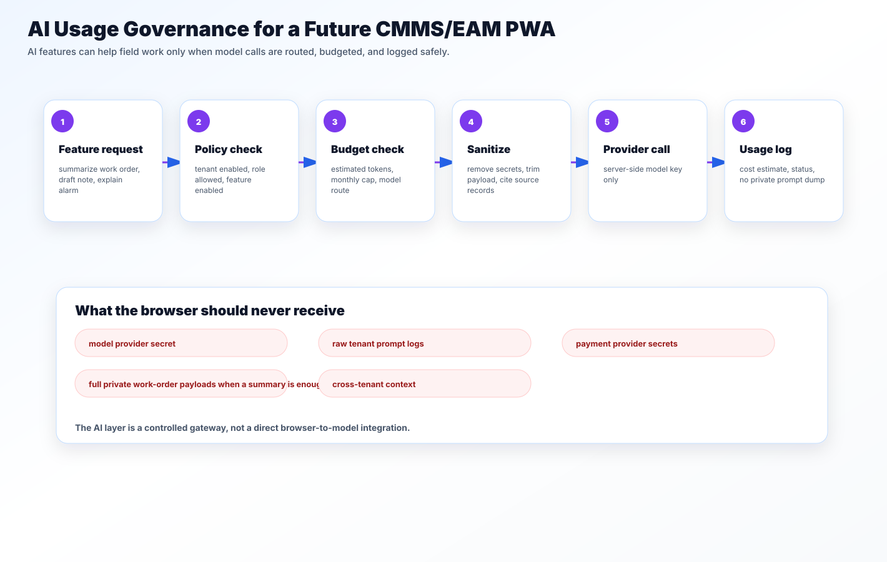

# AI Usage Governance

AI features should be useful and bounded. In a CMMS/EAM PWA, the safest first use cases are assistive:

- summarize work-order history;
- rewrite a technician note more clearly;
- explain a fault code;
- identify missing closeout evidence;
- draft a checklist for review.

## Server-side gateway

The browser should never receive a model provider key. AI calls should go through a gateway that checks:

- tenant feature enablement;
- actor role;
- model route allowlist;
- monthly budget;
- per-request cap;
- payload redaction;
- logging policy.

## Logging rule

Store metadata first, not raw private prompts.

Good metadata:

- feature name;
- tenant reference;
- actor reference;
- source record type;
- source record id;
- estimated tokens;
- model route;
- result status;
- cost estimate.

Avoid storing full private work-order notes unless the product has an explicit retention policy and user-facing controls.
