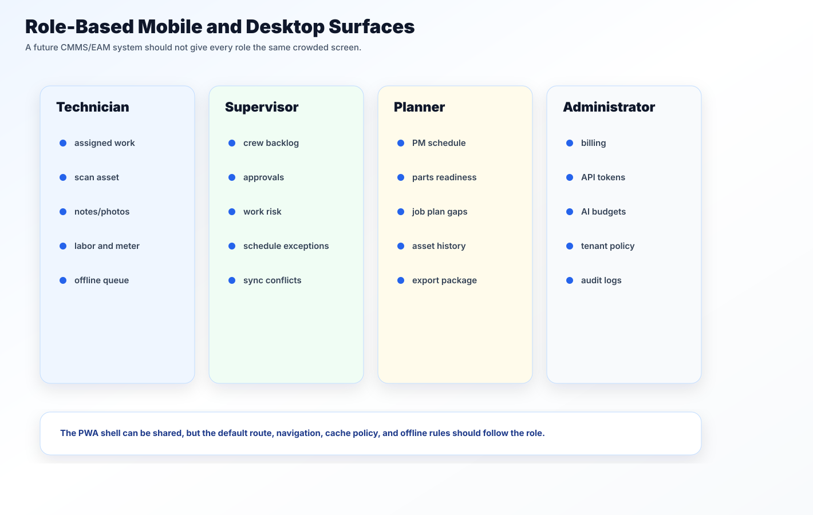

# Mobile Field UX

A CMMS mobile screen should not be a narrow version of a desktop table. It should be built around field actions.

## Primary field flows

- View assigned work.
- Search or scan an asset.
- Open work-order details.
- Add a note.
- Take or attach a photo.
- Enter labor time.
- Record a meter reading.
- Request parts.
- Update status.
- Check the offline queue.

## Layout rules

- Use cards for work orders on phones.
- Move secondary fields into expandable sections.
- Keep one primary action visible.
- Keep save and queue state close to the form.
- Avoid hover-only controls.
- Use input types that match the task: number, date, search, file capture.
- Keep destructive actions away from normal save actions.
- Treat scan/search as a top-level entry point.

## Role defaults

Different users should land in different places:

| Role | Default mobile surface |
| --- | --- |
| Technician | Assigned work, scan asset, offline queue |
| Supervisor | Crew backlog, approvals, sync conflicts |
| Planner | PM readiness, parts gaps, job plan exceptions |
| Admin | Entitlements, tokens, usage, audit |

